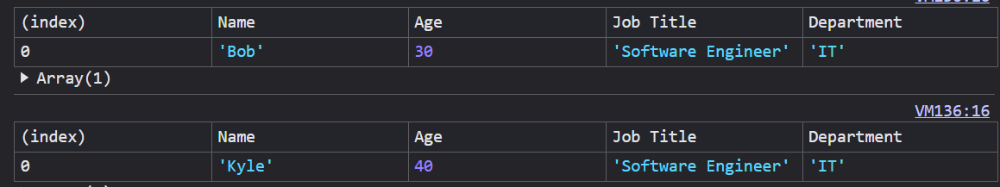

# Inheritance

Table Of Contents
- [Inheritance](#inheritance)
  - [Introduction](#introduction)
  - [Classical Inheritance](#classical-inheritance)
    - [Advantages Of Classical Inheritance](#advantages-of-classical-inheritance)
    - [Disadvantages Of Classical Inheritance](#disadvantages-of-classical-inheritance)
  - [Prototypal Inheritance](#prototypal-inheritance)
    - [Advantages Of Prototypal Inheritance](#advantages-of-prototypal-inheritance)
    - [Disadvantages Of Prototypal Inheritance](#disadvantages-of-prototypal-inheritance)
  - [Advanced Insights](#advanced-insights)
    - [Super keyword In Method Overriding](#super-keyword-in-method-overriding)
    - [Static Methods and Properties](#static-methods-and-properties)
    - [Private Methods and Properties](#private-methods-and-properties)
  - [Performance Optimization](#performance-optimization)
  - [Common Pitfalls](#common-pitfalls)

##  Introduction

- `Inheritance` refers to ability to inherit variables, methods from other object in **JavaScript**.
- There are two major type of `Inheritance`  in **JavaScript**.
  
  1. Classical Inheritance
  2. Prototypal Inheritance

## Classical Inheritance

- After **ES6**, classes are introduced in **JavaScript**.
  
- Providing <i>suger-coating</i> on **prototypes**.
  
- Classes includes **constructors, methods, super keyword** to facilitate properties initialization, implementing functionalitites, call the parent constructor respectively.
  
- Classes provide facility to create objects based on the class template, thus eliminating code redundancy.

```Javascript
class Person {
  constructor(name, age) {
    this.name = name;
    this.age = age;
  }
}

class Employee extends Person {
  constructor(name, age, jobTitle, department) {
    super(name, age);
    this.jobTitle = jobTitle;
    this.department = department;
  }

  displayEmployeeInfo() {
    console.table([{ 
      Name: this.name, 
      Age: this.age, 
      "Job Title": this.jobTitle, 
      Department: this.department 
    }]);
  }
}

const firstEmployee = new Employee("Bob", 30, "Software Engineer", "IT");
const secondEmployee = new Employee("Kyle", 40, "Software Engineer", "IT");

firstEmployee.displayEmployeeInfo();
secondEmployee.displayEmployeeInfo();
```

- Outputs



### Advantages Of Classical Inheritance

- Provides intuitive syntax for `inheritance`.
- Performace wise its better to use <i>Classical Inheritance</i> rather than <i>Prototypal Inheritance</i>

### Disadvantages Of Classical Inheritance

- <i>Classical Inheritance</i> is more rigid and supports less accessiblity for direct inheritance from other object.
- Doesn't provide dynamic object composition from other object.
  
---

## Prototypal Inheritance

- Before **ES6**, prototyes are used to perform `inheritance` in **JavaScript**.
    
- `prototype` is the type of link every object have which refers to another object.
  
- `prototype` is used to mimic functionalities of  **constructors, methods, super keyword** to facilitate properties initialization, implementing functionalitites, call the parent constructor respectively.
  
- Using `prototype` its easier to create objects based on the constructor function's `prototype`, thus providing flexibility.

```Javascript
function Person( name,age ){
    this.name = name;
    this.age = age;
 }

function Employee( name,age,jobTitle,department ) {
    Person.call(this,name,age);
    this.jobTitle = jobTitle;
    this.department = department;
}

Employee.prototype = Object.create(Person.prototype);
Employee.prototype = Employee;

Employee.prototype.displayEmployeeInfo = function() {
  console.table([{ 
    Name: this.name, 
    Age: this.age, 
    "Job Title": this.jobTitle, 
    Department: this.department 
  }]);
}


const firstEmployee = new Employee("Bob", 30, "Software Engineer", "IT");
const secondEmployee = new Employee("Kyle", 40, "Software Engineer", "IT");

firstEmployee.displayEmployeeInfo();
secondEmployee.displayEmployeeInfo();
```

- Outputs


### Advantages Of Prototypal Inheritance

- Provides flexibility for `inheritance` and dynamic changes in `prototype`.
- Provides direct access to other objects to inherit from.

### Disadvantages Of Prototypal Inheritance

- Performace wise its better to use <i>Classical Inheritance</i> rather than <i>Prototypal Inheritance</i>.
- Doesn't provide intuitive syntax for `inheritance`.


## Advanced Insights

### <i>Super keyword</i> In Method Overriding

```Javascript
class User {
  userType() {
    console.log("User is : ");
  }
}

class Employee extends User{
  userType() {
    super.userType();
    console.log("Employee");

  }
}

class Manager extends User{
  userType() {
    super.userType();
    console.log("Manager");

  }
}

const employee = new Employee();
employee.userType();


const manager = new Manager();
manager.userType();

// Outputs

// User is : 
// Employee

// User is : 
// Manager
```

### Static Methods and Properties

```Javascript
class Person {
  static user = "Employee";
  static userDescription() {
    console.log("User is employee");
  }
}
console.log(Person.user);
Person.userDescription();

// Outputs

// Employee
// User is employee
```

### Private Methods and Properties

```Javascript
class User {
  #userType = null;
  constructor(userType) {
    this.#userType = userType;
  }
  #accessPrivateProp() {
    console.log(`User type is : ${this.#userType}`);
  }
  accessUserType() {
    this.#accessPrivateProp();
  }
}

const employee = new User("employee");
employee.accessUserType();

// Outputs

// Employee
// User is employee
```

## Performance Optimization

- **Avoid using prototypal inheritance** : In some cases its better to use <i>Classical Inheritance</i>, because it provides more faster and optimized accessiblity.
- **Static variables / methods** : Used <i>static members</i> for shared logic and implementing common utilites for everything.

## Common Pitfalls

- **Avoid extending native `prototyes`** : Prototypes like `Object.prototype` should not be extended too much.
- **Overuse of inheritance** : By using inheritance everywhere, we introduce tightly coupled relationships everywhere, which should be avoided.