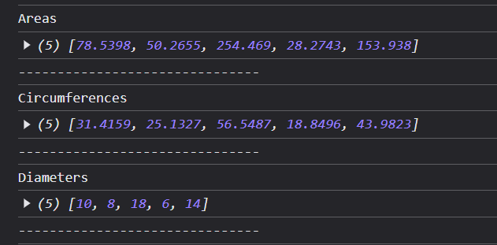
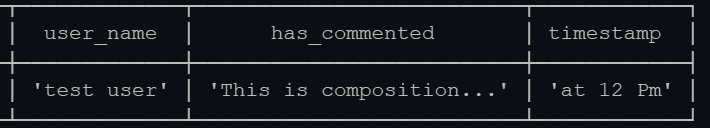

# Higher Order Functions

Table Of Contents
- [Higher Order Functions](#higher-order-functions)
  - [Introduction](#introduction)
    - [Function with Functions as arguments](#function-with-functions-as-arguments)
    - [Function with Returning a Function](#function-with-returning-a-function)
    - [Built-in Higher-order functions](#built-in-higher-order-functions)
      - [map()](#map)
      - [filter()](#filter)
      - [reduce()](#reduce)
      - [sort()](#sort)
    - [Creating Own map() Implementation](#creating-own-map-implementation)
    - [Composition Of Functions](#composition-of-functions)
    - [Currying Functions](#currying-functions)
    - [Debouncing](#debouncing)


## Introduction

- `Higher-order function` can be defined as function which either take one or more functions as arguments like callbacks or return function from it like closures.
- It helps in providing more flexibility.
- Can be used to create specialized functions.

### Function with Functions as arguments

```Javascript
function startTask() {
    console.log("Starting task processing...");
}
function processTask() {
    console.log("Task processing...");
}
function endTask() {
    console.log("Ending task processing...");
}
function handleTask(startTask, processTask, endTask) {
    startTask();
    processTask();
    endTask();
}

handleTask(startTask, processTask, endTask);
```

### Function with Returning a Function
- Suppose API will return this data
```Javascript

async function fetchUsersData(url) {
    const response = await fetch(url);
    const data = await response.json();
  
    return function(userId) {
        return data.filter(user => user.id === userId);
    };
}

(async () => {
    const getUserProfileById = await fetchUsersData("https://jsonplaceholder.typicode.com/users");
    console.log(`User profile:`, getUserProfileById(2)); 
})();
```

### Built-in Higher-order functions

- Some built-in functions are :
  #### map()
  #### filter()
  #### reduce()
  #### sort()

- These are highly used higher-order functions for arrays.
- For manipulating, transforming, creating arrays.
  
1. map()
   - **map()** transforms current array into a new array where each array element is manipulated.
   ```Javascript
        const nums = [1, 2, 3, 4, 5, 6, 7, 8, 9, 10];
        const fourthTable = nums.map(num => 4 * num);

        for (let i=0;i<fourthTable.length;i++)
            console.log(`4 * ${i+1} = ${fourthTable[i]}`);
   ```

2. filter()
   - **filter()** filters current array into a new array where each array element is - which passes the checks(conditions) or in easy language returns true.
   ```Javascript
        const nums = [1, 2, 3, 4, 5];
        const evens = nums.filter(num => num % 2 == 0);

        for (let i=0;i<evens.length;i++)
            console.log(`${evens[i]} is even`);
   ```

3. reduce()
   - **reduce()** accumulates current array into single value / reduced value, used for get the sum of array elements, average etc.
   - **reduce()** takes a 
     1. callback in which first argument is accumulator
     2. accumulator's initial value is second argument
   
   ```Javascript
        const nums = [1, 2, 3, 4, 5];
        const sum = nums.reduce((acc, num) => acc + num, 0);

        console.log(`Sum of 1 to 5 numbers is ${sum}`);
   ```

4. sort()
   - **sort()** sorts given array, by default it performs **lexicographical sorting** meaning numbers are treated as strings.
   - If ascending order sorting is required following program should be used.
   ```Javascript
        const nums = [100, 22, 323, 64, 45];
        const sortedNums = nums.sort((a, b) => a - b );

        for (let i=0;i<sortedNums.length;i++)
            console.log(sortedNums[i]);
   ```

### Creating Own map() Implementation

- Refer to below link for understanding how **map()** works. 
- [map()](#map)
- Here we will create our own **map()** specially for circles' methods.

```Javascript
    
    function area(radius) {
        return Math.PI * radius * radius;
    }
    function circumference(radius) {
        return 2 * Math.PI * radius;
    }
    function diameter(radius) {
        return 2 * radius;
    }

    const nums = [5, 4, 9, 3, 7];

    Array.prototype.circleUtils = function (logic) {
        const output = [];

        for (let i = 0; i < this.length; i++) {
            output.push(parseFloat(logic(this[i]).toFixed(4)));
        }

        return output;
    }


    console.log("Areas");
    console.log(nums.circleUtils(area));
    console.log("-------------------------------");

    console.log("Circumferences")
    console.log(nums.circleUtils(circumference));
    console.log("-------------------------------");

    console.log("Diameters");
    console.log(nums.circleUtils(diameter));
    console.log("-------------------------------");

```
- Outputs<br><br>
  

### Composition Of Functions

- When series of functions are required to perform we can batch them all at once.
- Thus input is processed step-by-step.

- Suppose user has entered a password and we want to add more things to the password then we can add those things one at a time.
  
```Javascript
    const userName = "test user";
    const comment = "This is composition";
    const time = "12 Pm";

    function userComments(comment) {
        return `${comment}...`;
    }

    function addTimestamp(action) {
        console.table(
            [
                {
                    user_name : `${userName}`,
                    has_commented : `${action}`,
                    timestamp : `at ${time}`
                }
            ]
         );
    }


    addTimestamp(userComments(comment));
```

- Outputs<br><br>
  

### Currying Functions

- **Currying** transforms a function which takes many arguments into small-small functions where each function takes one argument at a time processing arguments step-by-step.
```Javascript
    // Normal function
    // function multiply(a, b) {
    //     return a * b;
    // }

    // Curried function
    const multiply = a => b => a * b;

    const double = multiply(2);
    console.log(double(5)); 

    // Outputs
    // 10
```

### Debouncing 

- When we want to batch all the actions and sent them all as a single action then that process is known as **debouncing**.
- Example<br>
  [debouncing example](debouncing.html)