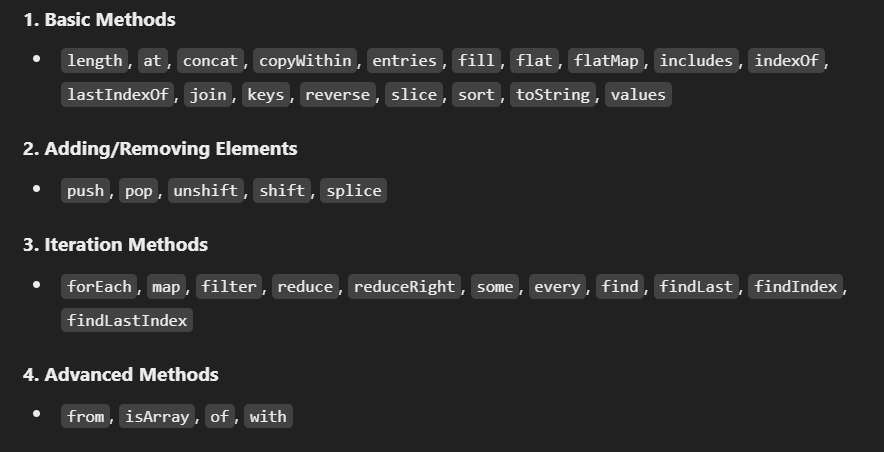

# Array Methods

Table Of Contents
- [Array Methods](#array-methods)
  - [Introduction](#introduction)
  - [Concepts to Learn](#concepts-to-learn)
    - [Basic Methods](#basic-methods)
      - [length](#length)
      - [at()](#at)
      - [concat()](#concat)
      - [copyWithin()](#copywithin)
      - [entries()](#entries)
      - [fill()](#fill)
      - [flat()](#flat)
      - [flatMap()](#flatmap)
      - [includes()](#includes)
      - [indexOf() \&\& lastIndexOf()](#indexof--lastindexof)
      - [join()](#join)
      - [keys()](#keys)
      - [reverse()](#reverse)
      - [slice()](#slice)
      - [sort()](#sort)
      - [toString()](#tostring)
      - [values()](#values)
    - [Adding/Removing Elements](#addingremoving-elements)
      - [push()](#push)
      - [pop()](#pop)
      - [unshift()](#unshift)
      - [shift()](#shift)
      - [splice()](#splice)
    - [Iteration Methods](#iteration-methods)
      - [forEach()](#foreach)
      - [map()](#map)
      - [filter()](#filter)
      - [reduce()](#reduce)
      - [reduceRight()](#reduceright)
      - [some()](#some)
      - [every()](#every)
      - [find()](#find)
      - [find()](#find-1)
      - [findLast()](#findlast)
      - [findIndex()](#findindex)
      - [findLastIndex()](#findlastindex)


## Introduction

- Array is powerful concept in **JavaScript** to form ordered collection of data under a single name.

## Concepts to Learn



### Basic Methods

   #### length
   - **length** is a property of array which returns the current length / number of elements in array.
   - It is not a method.
   - Used to dynamically determine the number of elements.
   - We can also truncate the array elements by reducing the value of this property.

  ```Javascript
    const arr = [1, 2, 3, 4, 5];
    console.log(arr.length);

    // Outputs
    // 5
    arr.length = 3;
    console.log(arr.length);

    // Outputs
    // 3
  ```

   #### at()
   - **at()** is a method to determine the element at the given index.
  
  ```Javascript
    const arr = [1, 2, 3, 4, 5];
    console.log(arr.at(2));

    // Outputs
    // 3
  ```

   #### concat()
   - **concat()** is a method used to concat arrays.
  
  ```Javascript
    const arr1 = [1, 2, 3, 4, 5];
    const arr2 = [6, 7, 8, 9, 10];
    console.log(arr1.concat(arr2));

    // Outputs
    // 1, 2, 3, 4, 5, 6, 7, 8, 9, 10
  ```

   #### copyWithin()
   - **copyWithin()** is a method, which modifies original array to copy given range of elements in the same array, maintaining the original length of array (i.e overwrites).
     - arguments :
       1. target - where to start putting copied elements.
       2. start - where to start copying from.
       3. end -  where to end copying of elements.
  
  ```Javascript
    const arr = ["one", "two", "three", "four", "five"];
    console.log(arr.copyWithin(1,2,3));

    // Outputs
    // ['one', 'three', 'three', 'four', 'five']
  ```

   #### entries()
   - **entries()** is a method which returns an iterator object consist of given array's key-value pairs having index and element.
  
  ```Javascript
    const arr =  ["one", "two", "three", "four", "five"];
    const iterator = arr.entries();

    for(let [index, elem] of iterator) {
      console.log(`Element ${elem} is at index ${index}`);
    }

    // Outputs
    // Element one is at index 0
    // Element two is at index 1
    // Element three is at index 2
    // Element four is at index 3
    // Element five is at index 4
  ```

   #### fill()
   - **fill()** fills given **value** from **start** to **end** in original array.
     - arguments :
       1. value - value to fill array with.
       2. start - where to start filling from.
       3. end -  where to end filling of elements.
  
  ```Javascript
    const arr = [1, 2, 3, 4, 5];
    console.log(arr.fill(0, 2, 5));

    // Outputs
    // 1, 2, 0, 0, 0
  ```

   #### flat()
   - **flat()** returns a new array sub-array elements of array are flatten(concated) to a specified depth.
  
  ```Javascript
    const arr = [1, [2, 3], [[4, 5]], [[[6]]]];
    const flatten = arr.flat(2);
    console.log(flatten);
    
    // Outputs
    // 1, 2, 3, 4, 5, [6]
  ```

   #### flatMap()
   - **flatMap()** maps each array element with a function and flats array till one level and returns a new array.
  
  ```Javascript
    const arr = [1, 2, 3];
    const flatten = arr.flatMap(num => [num, num * 2]);
    console.log(flatten);

    // Outputs
    // 1, 2, 2, 4, 3, 6
  ```

   #### includes()
   - **includes()** either returns true if element is found in array or false otherwise.
  
  ```Javascript
    const arr = [1, 2, 3];
    console.log(arr.includes(5));

    // Outputs
    // false
  ```

   #### indexOf() && lastIndexOf()
   - **indexOf()** returns index of first occurence of the given element.
   - **lastIndexOf()** returns index of last occurence of the given element.
  
  ```Javascript
    const arr =  ["one", "two", "three", "four", "three"];
    console.log(arr.indexOf("three"));
    console.log(arr.lastIndexOf("three"));

    // Outputs
    // 2
    // 4
  ```

  #### join()
  - **join** converts an array into string with joining elements of array with given separator.

  ```Javascript
    const arr =  ["This", "is", "joined", "with", "hyphens"];
    console.log(arr.join("-"));

    // Outputs
    // This-is-joined-with-hyphens
  ```

  #### keys()
  - **keys** returns an iterator having keys(indices) of given array.
  
  ```Javascript
    const arr =  ["This", "is", "joined", "with", "hyphens"];
    const iterator = arr.keys();
    
    for (let idx of iterator)
        console.log(idx);

    // Outputs
    // 0
    // 1
    // 2
    // 3
    // 4 
  ```

  #### reverse()
  - **reverse** reverses an array elements in place.

  ```Javascript
    const arr =  ["This", "is", "joined", "with", "hyphens"];
    arr.reverse();
    console.log(arr);

    // Outputs
    // ['hyphens', 'with', 'joined', 'is', 'This']
  ```
  
  #### slice()
  - **slice** slices an array's elements and returns new array with sliced elements.

  ```Javascript
    const arr =  ["This", "is", "joined", "with", "hyphens"];
    console.log(arr.slice(1,3));

    // Outputs
    // [is', 'joined']
  ```

  #### sort()
  - **sort** sorts an array's elements in place, but by default it sorts alphabetcally if numbered is required there must be a comparison function passed as argument.

  ```Javascript
    const arr =  [43,59,35,6,443];
    arr.sort( (a,b) => a - b );

    console.log(arr);

    // Outputs
    // [6, 35, 43, 59, 443]
  ```
  
  #### toString()
  - **toString** converts an array to a string separated by commas.

  ```Javascript
    const arr = ["apple", "banana", "cherry"];
    console.log(arr.toString());

    // Outputs
    // "apple,banana,cherry"
  ```

  #### values()
  - **values** returns an iterator having values(elements) of given array.
  
  ```Javascript
    const arr =  ["This", "is", "joined", "with", "hyphens"];
    const iterator = arr.values();
    
    for (let val of iterator)
        console.log(val);

    // Outputs
    // This
    // is
    // joined
    // with
    // hyphens
  ```
  
### Adding/Removing Elements

  #### push()
  - **push** adds one or more elements at end in original array returning length of new array.
  
  ```Javascript
    const arr =  [1, 2, 3, 4];
    console.log(`New length is ${arr.push(5)}`);
    console.log(`Updated array is ${arr}`);

    // Outputs
    // New length is 5
    // Updated array is 1, 2, 3, 4, 5
  ```

  #### pop()
  - **pop** removes one or more elements from end in original array returning removed elements.
  
  ```Javascript
    const arr =  [1, 2, 3, 4, 5];
    console.log(`Removed element is ${arr.pop(5)}`);
    console.log(`Updated array is ${arr}`);

    // Outputs
    // Removed element is 5
    // Updated array is 1, 2, 3, 4
  ```

  #### unshift()
  - **unshift** adds one or more elements at begining in original array returning length of new array.
  
  ```Javascript
    const arr =  [2, 3, 4, 5];
    console.log(`New length is ${arr.unshift(1)}`);
    console.log(`Updated array is ${arr}`);

    // Outputs
    // New length is 5
    // Updated array is 1, 2, 3, 4, 5
  ```
  #### shift()
  - **shift** removes one or more elements from begining in original array returning removed elements.
  
  ```Javascript
    const arr =  [1, 2, 3, 4, 5];
    console.log(`Removed element is ${arr.shift(1)}`);
    console.log(`Updated array is ${arr}`);

    // Outputs
    // Removed element is 1
    // Updated array is 2, 3, 4, 5
  ```

  #### splice()
  - **splice** used to add, remove, replace elements in original array.
     - arguments :
       1. start - where to start opeations.
       2. deleteCount - how many elements to remove.
       3. items... - elements to add / replace.

  ```Javascript
    const arr =  ["this", "is", "str"];
    arr.splice(1, 2, "is", "new", "string");
    console.log(`Updated array is : ${arr}`);

    // Outputs
    // Updated array is : this,is,new,string
  ```

### Iteration Methods

  #### forEach()
  - **forEach** is used to execute a function  on all elements in an array.

  ```Javascript
    const arr =  ["this", "is", "str"];
    arr.forEach( (elem, idx) => console.log(`${elem} is at position ${idx}`) );

    // Outputs
    // Element : 'this' is at position 0
    // Element : 'is' is at position 1
    // Element : 'str' is at position 2
  ```

  #### map()
  - [map() explanation](HOFs.md/#map)
  
  #### filter()
  - [filter() explanation](HOFs.md/#filter)
  
  #### reduce()
  - [reduce() explanation](HOFs.md/#reduce)

  #### reduceRight()
  - **reduceRight** is same as reversing working of **reduce**.
  - Meaning this method starts accumulating elements from end to start(i.e. from right to left).
  - It accepts an optional accumulator value, if not provided it defaults to last element of array.
  
  ```Javascript
      const arr =  [10, 20, 30];

      console.log(`Sum : 
                        ${
                        arr.reduceRight( (acc, num) => {
                                   
                                      console.log(`${num} is being processed`);
                                    
                                      return acc + num;
                                    
                                      }, 0);
                          }
                `);

    // Outputs
    // 30 is being processed
    // 20 is being processed
    // 10 is being processed
    // sum : 60
  ```

  #### some()
  - **some** checks if atleast one element in an array that satisfies the given condition.
  - It returns true / false.
  
  ```Javascript
    const arr =  ["this", "is", "str"];

    console.log(arr.some( str => str.length < 3 ));

    // Outputs
    // true
  ```

  #### every()
  - **every** checks if all elements of array satisfies the given condition.
  - It returns true / false.
  
  ```Javascript
    const arr =  ["this", "word", "look"];

    console.log(arr.every( str => str.length ==  4 ));
    
    // Outputs
    // true
  ```

  #### find()
  - **find** checks all elements of array and returns the first element which satisfies the given condition.
  
  ```Javascript
    const arr =  ["this", "word", "look"];

    console.log(arr.find( str => str.length ==  4 ));

    // Outputs
    // this
  ```

  #### find()
  - **find** checks all elements of array and returns the first element which satisfies the given condition.
  
  ```Javascript
    const arr =  ["this", "word", "look"];

    console.log(arr.find( str => str.length ==  4 ));

    // Outputs
    // this
  ```

  #### findLast()
  - **findLast** checks all elements of array and returns the last element which satisfies the given condition.
  
  ```Javascript
    const arr =  ["this", "word", "look"];

    console.log(arr.findLast( str => str.length ==  4 ));

    // Outputs
    // look
  ```

  #### findIndex()
  - **findIndex** checks all elements of array and returns the first element's index which satisfies the given condition.
  
  ```Javascript
    const arr =  ["two", "word", "look"];

    console.log(arr.findIndex( str => str.length ==  4 ));

    // Outputs
    // 1
  ```
  
  #### findLastIndex()
  - **findLastIndex** checks all elements of array and returns the last element's index which satisfies the given condition.
  
  ```Javascript
    const arr =  ["this", "word", "look"];

    console.log(arr.findLastIndex( str => str.length ==  4 ));

    // Outputs
    // 2
  ```


  